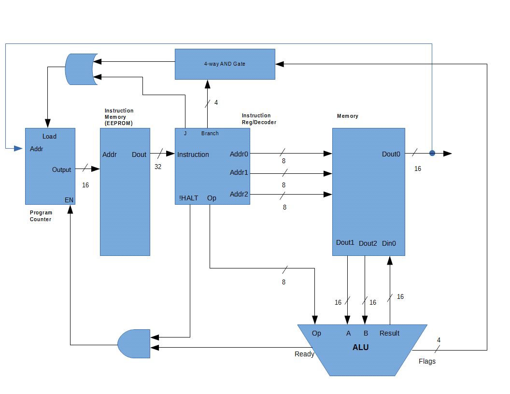

ECE486 Final Project
====================

by William Harrington

Introduction
------------

The objective of this project was to design, model, simulate, and test
an application specific-processor for cryptographic block cipher
algorithms. The target algorithm was International Data Encryption
Algorithm. However, the system should've been designed to achieve high
throughput and low latency for executing block cipher algorithms in
general, not just the IDEA algorithm.

Cyptographic block cipher algorithms
------------------------------------

"A block cipher is a deterministic algorithm operating on fixed-length
groups of bits, called blocks, with an unvarying transformation that is
specified by a symmetric key"$^{[1]}$. Some example block ciphers are
Data Encryption Standard, Advanced Encryption Standard, RC5, and
Blowfish. Many block ciphers, including the ones just named, are ARX
algorithms$^{[1]}$, which means their operations only involve modular
addition, bit rotation, and exclusive-or. Other simple logic operations
and bit manipulations may also be involved.

Application-Specific Processor
--------------

This section explains in detail the application-specific processor that was designed to handle block cipher encryption algorithms.

## Instruction Set Architecture (ISA)

The Instruction Set Architecture is the portion of the computer architecture that is visible to the programmer$^{[2]}$.
This section discusses the analysis that was involved in choosing an ISA, and provides specification for the ISA that was chosen.

### Analysis

The purpose of this analysis was to determine the best instruction set architecture for low latency. With regard to latency, memory latency is often a major concern.
Since the processor was to be designed for block cipher algorithms which are typically ARX algorithms, a generic ARX algorithm was developed and used to analyze memory traffic with different instruction set architectures.
The following were analyzed: Stack, Accumulator, Load-Store, and Memory-memory.
The generic ARX algorithm is given below in traditional C syntax and then translated into assembly for each of the aforementioned architectures.

The following items were examined

* How many instruction bytes are fetched
* How many bytes of data are transferred from/to memory
* How much total memory traffic (code + data)

#### Generic ARX Algorithm in C syntax

The following assumptions are made for the code below

* A, B, C, D are unsigned 16-bit integers
    * They are initialized to some value and are in memory
* The function prototype for the rotate function is: uint16_t Rotate(uint16_t toRotate, uint16_t amountOfRotation)
    * The direction of the rotation makes no difference

<!-- -->
	Result = Rotate(A + B, C) ^ D;
<!-- -->

#### Generic ARX Algorithm in assembly

The following assumptions are made for each instruction set

* The processor uses a 16-bit memory address and data operands
* The opcode is always one byte (8 bits).
* Memory accesses use direct, or absolute, addressing.
* The variables A, B, C, and D are initially in memory.
* For a load-store architecture, there are 16 general-purpose registers.
* When Mem[Addr] is used, this location in memory is NOT the same as A, B, C, D

Result is the place in memory where the result of the algorithm goes.
Also, the mnemonics used are generic like those used in Computer Architecture,
5th edition by Hennessy and Patterson Appendix A Section 2.

<!-- -->

    Stack
    -----
        Push A                    #&
        Push B                    #&
        Add                       #&
        Pop  Mem[0]                %
        Push Mem[0]               #&
        Push C                    #&
        Rotate                    #&
        Pop  Mem[1]                %  
        Push Mem[1]              *#&
        Push D                    #&
        XOR                       #&
        Pop  Result                %

    Accumulator
    -----------
        Add    A                  #& ;Assume accumulator initialized to 0
        Add    B                  #&
        Store  Mem[0]              %
        Rotate C                  #&
        Store  Mem[1]              %         
        XOR    D                  #&
        Store  Result              %         

    Load-Store
    ----------
        Load   R1, A              #&
        Load   R2, B              #&
        Add    R3, R1, R2         #&
        Load   R4, C              #&
        Rotate R5, R3, R4         #&
        Load   R6, D              #&
        XOR    R7, R5, R6         #&
        Store  Result, R7          %

    Memory-memory
    -------------
        Add    Mem[0], A, B       #%
        Rotate Mem[1], C, Mem[0]  #%
        XOR    Result, D, Mem[1]  #%

    * value is loaded from memory after having been loaded once
    # the result of one instruction is passed to another instruction as an operand
    & storage within the processor
    % storage in memory

<!-- -->

  ---------------------------------------------------------------
  Architecture   Instruction Bytes     Bytes from/to  Code + Data
                 fetched               mem            
  ------------   --------------------- -------------- -----------
  Stack           30                    18             48

  Accumulator     35                    14             49

  Load-store      32                    10             42

  Memory-memory   21                    0              21
  ---------------------------------------------------------------

  Table: Comparison of memory traffic

#### Conclusion and ISA choice

The memory-memory architecture had the least amount of total memory traffic.
This means that memory latency is at a minimum and gives the optimal solution for latency.
It also has the advantage of being most compact as it doesn't use
extra registers for holding temporary variables like all the other architectures would.

There are downsides to this architecture however that are not apparent in the above analysis.
For instance, there is a variation in instruction size when not using three-operand instructions.
In the psuedo-code for the memory-memory architecture, three operands were used for each instruction.
In the case of a two operand instruction, extra bits would have to be ignored somehow or utilized in a different way.
Also, the work per instruction would vary. As in the case of a two operand instruction like say Store or Load, the ALU
isn't really needed. Lastly, memory accesses can create a bottleneck.

For the purpose of this project, throughput is most important which means having the least amount
of total memory traffic is most desired. Therefore, the memory-memory ISA was chosen.

### Instruction Format

  -----------------------------------
  Opcode  Operand2 Operand1  Operand0
  ------- -------- --------  --------
  31-24   23-16    15-8      7-0
  -----------------------------------

  Table: Instruction format

Table 4 shows the instruction format of the instruction set architecture.
The numbers in the table represent the bit positions of each category.
Thus the opcode is the MSB of the instruction while Operand0 is the LSB of the instruction.
Operand2 is the 2nd MSB and Operand1 is the 2nd LSB.
The length of the instruction is fixed.
This was chosen because it emphasizes performance and reduces the complexity of decoding.

Operand2 is the address in memory where the result is to be stored.
Operand1 is the address in memory that provides the value for the first operand
to be supplied to the ALU.
Operand0 is the address in memory that provides the value for the second operand
to be supplied to the ALU.

Traditionally, the operands supplied to an ALU are referred to as A and B.
Operand1 is the equivalent of A and Operand0 is the equivalent of B.

#### Addressing modes

Addressing modes define how a given instruction set architecture identify the operands of each instruction.
No addressing modes are supported in this ISA.
The reason for behind this choice had to do with the fact that addressing modes primarily benefit
the programmer and that was not a goal of this project.
Thus, all addresses given by an instruction point to a value in memory and not some other object such as a register.

#### Opcodes

The table below specifies the opcodes available in the architecture along with providing an example usage and description.

  --------------------------------------------------------------------------------------------------------
  OP      Encoding Usage                           Ex (hex)      Description
  ------- -------- ------------------------------  ------------  -----------------------------------------
  ADD     0x0      ADD   Mem[Z], Mem[Y], Mem[X]    00 02 01 00   Mem[Z] = Mem[X] + Mem[Y]

  SUB     0x1      SUB   Mem[Z], Mem[Y], Mem[X]    01 02 01 00   Mem[Z] = Mem[X] - Mem[Y]

  MUL     0x2      MUL   Mem[Z], Mem[Y], Mem[X]    02 02 01 00   Mem[Z] = Mem[X] * Mem[Y]

  OR      0x3      OR    Mem[Z], Mem[Y], Mem[X]    03 02 01 00   Mem[Z] = Mem[X] | Mem[Y]

  AND     0x4      AND   Mem[Z], Mem[Y], Mem[X]    04 02 01 00   Mem[Z] = Mem[X] & Mem[Y]

  XOR     0x5      XOR   Mem[Z], Mem[Y], Mem[X]    05 02 01 00   Mem[Z] = Mem[X] ^ Mem[Y]

  LOAD    0x6      LOAD  Mem[Y], Imm Val or Mem[X] 06 1111 01    Mem[Y] = Value or Mem[X]

  STORE   0x7      STORE Imm Val or Mem[X], Mem[Y] 07 1111 02    Mem[Y] = Value or Mem[X]

  BZ      0x8      BZ    Mem[Z], Mem[Y], Mem[X]    08 03 02 01   Branch if Mem[Y]=0  or Men[X]=0.
                                                                 Next PC = Mem[Z].

  BEQ     0x9      BEQ   Mem[Z], Mem[Y], Mem[X]    09 03 02 01   Branch if Mem[Y] == Mem[X].
                                                                 Next PC = Mem[Z].

  BP      0xA      BP    Mem[Z], Mem[Y], Mem[X]    0A 03 02 01   Branch if Mem[Y] > 0 or Mem[X] > 0.
                                                                 Next PC = Mem[Z].

  BN      0xB      BN    Mem[Z], Mem[Y], Mem[X]    0B 03 02 01   Branch if Mem[Y] < 0 or Mem[X] < 0.
                                                                 Next PC = Mem[Z].

  JMP     0xC      JR    Value                     0C 00 00 00   Jump to instruction specified by value.
                                                                 Next PC = Value. Extra bits are ignored.

  HALT    0xD      HALT                            0D 00 00 00   Halt execution.

  NOP     0xE      NOP                             0E 00 00 00   No op.

  MODM    0xF      MODM Mem[Z], Mem[Y], Mem[X]     0F 03 02 01   Multiplication modulo $2^{16}$ + 1.
                                                                 Mem[Z] = (Mem[Y]*Mem[X]) % ($2^{16}$ + 1)
  --------------------------------------------------------------------------------------------------------

  Table: Opcodes given in hexadecimal along with usage examples and explanations.

## Microarchitecture

The mircoarchitecture of a processor refers to the way hardware is implemented for a given ISA.
This section discusses what hardware was designed to implement the memory-memory architecture
described in the previous sections.

### Design considerations

Since the architecture is memory-memory and minimizing latency
is a goal of the project, the latency of the memory employed
was of utmost importance. The details of these
modules are discussed in the following sections but
their latency clearly dictates the clock period
to be used for the implementation.
The ALU is the second most important part of the architecture.
The reason for this is that the ALU has to finish
operating on the operands before anything can be
done with them such as writing back to memory or 
determining the outcome of a branch.
With regard to encryption, in algorithms like IDEA,
the latency of the ALU is especially prominent because
of sophisticated operations like multiplication modulo $2^{16}$ + 1.
These considerations played a major role in the
development of the memory and ALU.

### Overview

{ width=75% height=75% }

The components chosen for the microarchitecture were:

* Program Counter
* Instruction Memory
* Instruction Register/Decoder
* Memory module
* Arithmetic Logic Unit (ALU)

These components were used to construct a 5-stage unpipelined multi-cycle processor.
This means that it takes multiple cycles for an instruction to complete.
Figure 1 depicts the organization of these components.
The reason for this design choice had to do with the unrealistic
constraints that a single-cycle processor would put on the memory and ALU.
The architecture was not pipelined to eliminate the hardware overhead
associated with hazards. Thus, these components compose a minimal solution for the ISA
while still being able to handle the task of encryption.

#### Stages

##### Instruction Fetch

During this stage, the PC is incremented with its own internal ALU. This takes one cycle to complete.
Once complete the PC outputs a 16-bit integer that is address of the next instruction to grab from
the instruction memory. The memory location specified by the output of the program counter is then 
accessed. The output of the instruction memory is a 32-bit instruction that is connected to the input
of the instruction register/decoder.

##### Decode

The instruction is split up according to the instruction format specified by the ISA.
The decoder looks for branch and jump instructions and sets the flags listed below.

* J - Jump
* Branch - Condition for branching
    * bz - branch if ALU zero flag is set
    * bn - branch if ALU negative flag is set
    * beq - branch if ALU equal flag is set
    * bp - branch if ALU positive flag is set

The branch flags are sent to a four way AND gate where they are ANDed with the flags from the ALU.
The result of this ANDing is sent to an OR-gate where they are ORed with the jump flag.
The result from the OR-gate is a control signal for the program counter.
This control signal is an important part of branch completion.

As specified by the ISA, the instruction contains addresses for the operands to be sent to the ALU
and the address of where the result should be stored in memory. These addresses are passed on
to the memory module. The instruction also contains the op code which is passed on to the ALU.
This stage takes one clock cycle to complete.

##### Memory Access

The memory module uses the addresses supplied by the decode stage to access those
locations in memory and then pass them on to the ALU. This stage takes one cycle to complete.

##### Execute

The ALU uses the op code from the decode stage to determine what operation to perform
once the memory module has supplied the operands. Once they are supplied, the ALU performs
the operation and yields the result. The amount of cycle this stage takes to complete
varies based on the operation to be performed.

##### Write Back / Branch Completion

Once the ALU has completed its operation, the result is written back to memory.
At the completion of the operation the flags of the ALU are set.
These flags are set regardless of the instruction being a branch.
If the instruction is a branch, then they are used for determining
the outcome of the branch.

### Functional Description

#### Program Counter

The program counter outputs a 16-bit value that is the address of the next
instruction within the instruction memory. The program counter is incremented
only when the enable signal (EN) is asserted. This input is controlled by the
logical AND'ing of the ALU ready signal and the !HALT signal from the
IR/Decoder.
Each time that EN is asserted the output of the PC increments to start the processing of the next instruction.
The PC has another control signal called load.
This signal causes the value on the address bus (Addr) to get latched into the PC
and it becomes the next instruction that is fetched from the instruction memory.
The load signal is controlled by the logical OR'ing of the jump signal (J) and
the AND'ing of the branch bits (Branch) with the flag bits (Flags) from the ALU.
The address bus (Addr) is driven by one of the address outputs of the IR/Decoder (Addr0).

##### Signals

* Inputs
    * Addr - 16 bit value used for jumping and breaks
        * Connected Addr0 output of Instruction Register/Decoder
        * Becomes next PC output when Load and En asserted
    * Load - Digital control signal used for jumping and breaks
        * Connected to OR-gate output of branch and jump flags
    * En - Digital control signal used for incrementing the counter
        * Connected to the AND-gate output of the ready signal from the ALU
          and !HALT from Instruction Register/Decoder
* Outputs
    * Output - 16 bit value that is the address of the next instruction to execute

#### Instruction Memory

The instruction memory contains the instructions to be executed.
It has one input which is a 16-bit address from the program counter.
Each address contains the instruction to be passed to the IR/Decoder.
The output is a 32-bit instruction that goes to the input of the IR/Decoder.
It was assumed

#### Instruction Register/Decoder (IR/Decode)

The instruction register/decoder seperates the instruction into the
pieces specified by the ISA and passes these pieces on to the memory
module and ALU.
It receives a 32-bit instruction from the instruction memory and
parses the most significant 8-bits, which represent the opcode, to
detect what kind of operation is getting ready to happen. If a halt is
detected, it drives the !HALT signal low, causing the PC to stop
incrementing. If a jump is detected, it drives the J signal high which asserts
the load signal on the program counter. The branch bits (Branch) are passed
on to a 4-way AND gate where they are AND'ed with the flag bits (Flags) from the ALU.
The op bits are then passed on to the ALU.
The 24 bits after the op code are separated into three 8-bit addresses
that are passed on to the memory module.

##### Signals

* Inputs
    * Instruction - 32 bit instruction
        * Connected to output of instruction memory
* Outputs
    * J - jump flag
        * Connected to OR gate with result of 4-way AND gate of branch bits
    * Branch - Branch bits
        * bz - branch zero instruction detected
        * bn - branch negative instruction detected
        * beq - branch eq instruction detected
        * bp - branch positive instruction detected
            * Connected to 4-way AND gate with flags from ALU
    * Addr0, Addr1, Add2 - 8 bit addresses for memory access
        * Connected to input of memory module
    * !Halt - Halt instruction detected, active low
        * Connected to AND gate with ALU ready signal
    * Op - 8 bit op code
        * Connected to ALU

#### Memory module

The memory module is a small quick memory that has 2 read only ports and 1 bi-directional
port for reading and writing data. The bi-directional port is Port 0.
This port is utilized by Operand0 which is the address in memory where the value is stored
or the value in memory where the PC will jump/branch to.
Port 1 and Port 2 are the ports for operands A and B respectively.
These ports are read only. This design choice was made to help
avoid memory bottlenecks and data hazards.

The memory module was implemented with assumption of a modified PC100 SDRAM$^[3]$.
Assuming a clock cyle period of 20ns,
it takes 1 clock cycle to read or write to the memory module.

##### Signals

* Inputs
    * Addr0, Addr1, Addr2 - Addresses to access
        * Connected to outputs of IR/Decoder
    * Din0 - Data input for Port 0
        * Connected to output for ALU
    * WE - Write enable for Port 0 (not pictured in diagram)
        * Connected to ready signal on ALU
* Outputs
    * Dout1, Dout2 - Output value at addresses Addr1, Addr2
        * Connected to A, B inputs of ALU
    * Dout0 - Output value at address Addr0
        * Connected to Addr input of PC, used for branching/jumping

#### Arithmetic Logic Unit (ALU)

The ALU is a combinational circuits that performs arithemetic operations.
This component is a crucial component of any processor.
Special considerations were given to the ALU for this specific application.
In particular, the ALU has to perform the multiplication modulo $2^{16}$ + 1
as specified by the ISA. With a circuit like a ripple carry adder/subtractor,
performing this operation would take a really long time thereby significantly
reducing throughput. Instead of something archaic like the ripple carry adder,
a bit-serial implementation$^{[5]}$ was used to significantly reduce the clock cycles
needed for this. This choice also allows the ALU to handle other operations quickly.

##### Signals

* Inputs
    * Op - 8 bit op code from instruction register/decode
    * A, B - 16 bit operands from memory
* Outputs
    * Result - 16 bit result for operation
        * Connected to memory for write back
    * Flags - Flags for conditional branching
        * N - One or both operands negative
        * P - One or both operands positive
        * Z - One or both operands zero
        * E - Operands equal
            * Connected to 4-way AND gate whose output controls load on PC 
    * Ready - Control signal connected to AND gate with !HALT
              from IR/Decoder

### Instruction timing

  ---------------------------------------
  OP    Clock cycles  OP     Clock cycles
  ----- ------------  ------ ------------
  ADD   6             STORE  6  

  SUB   6             MUL    6

  BEQ   6             BZ     6

  BP    6             BN     6

  JR    6             NOP    6

  HALT  6             MODM   40

  OR    6             AND    6

  XOR   6             LOAD   6
  ---------------------------------------

  Table: Instruction timing

**Average clock cycles per instruction = 8.13**

##### Throughput = 16 bits / (8.13*20ns) = 98.4 MB/s

### Design optimizations

#### Avoiding hazards

A Harvard architecture was chosen for instruction memory and data.
This means that the instruction memory and data memory are separated.
The program counter has its own internal also has its own internal ALU for addition.
This means that the program counter doesn't need the ALU that performs operations on the operands to increment.
These choices were made to avoid structural hazards.

#### Dealing with the memory bottleneck

The memory module has three ports with two being read-only.
This means only one port can be written to.
This choice was made to avoid a memory bottleneck.

#### Lowering latency

Since the architecture is memory-memory, small quick
memories are used for the implementation of the instruction memory and memory module.
The clock cycle time for accessing both the instruction memory
and the memory module was 1 assuming a clock period of 20ns.
This was done to minimize memory latency.

#### Maximizing throughput

The ALU uses a bit-serial implementation to quickly process sophisticated
operations like multiplication modulo $2^{16}$ + 1. A bit-serial implementation
can handle multiplication modulo $2^{16}$ + 1 in 35 clock cycles and all other
operations specified by the ISA in 1 clock cycle.

## International Data Encryption Algorithm

The International Data Encryption Algorithm (IDEA) is a symmetric-key block
cipher that operates on 64-bit plaintext blocks. The encryption key is 128-bits
long, and the same algorithm is used for both encryption and decryption. IDEA
uses Exclusive-OR ($\oplus$), addition modulo $2^{16}$ ($\boxplus$), and
multiplcation modulo $2^{16} + 1$ ($\odot$) operations during its "rounds" for
encryption and decryption. All operations are performed on 16-bit sub-blocks
with a 16-bit subkey.

### Key scheduling

IDEA uses 52 subkeys: six for each of the eight rounds and four more
for the output transformation. In order to do this, the original key is broken
up into six subkeys then rotated left by 25 bits. This is done until all 52
subkeys are created.

### Algorithm for Encryption

The encryption and decryption algorithm is composed of 8 "rounds" that take 14
identical steps followed by a final output transformation that is referred to as
a "half-round". The operations are performed with a 64-bit plaintext block and a
128-bit key. The plaintext block is separated into four 16-bit sub-blocks: $X_1,
X_2, X_3, X_4$. The key is eventually broken down into 52 sub-keys. However, it
is first split up into eight 16-bit sub-keys: $K_1,....,K_8$. The first six
($K_1,..,K_6$) are used in the first round and the last two ($K_7, K_8$) are the
first two used in the second round. The key is then rotated 25 bits to the left
and split up into eight more 16-bit sub-keys: $K_9,...,K_{16}$. The first four
($K_9,..,K_{12}$) are used in round two after $K_7, K_8$; the last four are used
in round 3. The key is rotated to the left again 25-bits to obtain the next
eight subkeys, and so on until the end of the algorithm.$^{[5]}$

The steps for each round are listed below. Exclusive-OR = $\oplus$, Addition
modulo $2^{16}$ = $\boxplus$, and Multiplcation modulo $2^{16} + 1$ = $\odot$.

 -----------------------------------------------------------
 Step  Operation                Step  Operation              
 ---  -----------------------   ----  ---------------------- 
 1.   $X_1$ $\odot$ $K_1$       8.    Step6 $\boxplus$ Step7 

 2.   $X_2$ $\boxplus$ $K_2$    9.    Step8 $\odot$ $K_6$    

 3.   $X_3$ $\boxplus$ $K_3$    10.   Step7 $\boxplus$ Step9 

 4.   $X_4$ $\odot$ $K_4$       11.   Step1 $\oplus$ Step9   

 5.   Step1 $\oplus$ Step3      12.   Step3 $\oplus$ Step9   

 6.   Step2 $\oplus$ Step4      13.   Step2 $\oplus$ Step10  

 7.   Step5 $\odot$ $K_5$       14.   Step4 $\oplus$ Step10 
 -----------------------------------------------------------

 Table: IDEA algorithm steps and their associated operation 

The output of the round is the four sub-blocks: $O_1$, $O_2$, $O_3$, $O_4$ that
are the results of steps 11, 12, 13, and 14. These are the input to the next
round. This happens eight times and on the eight round the inner blocks are
swapped then followed by a final output transformation.

The final output transformation consists of the four steps in the table below.

 ---------------------------------------------------------
 Step  Operation              Step  Operation              
 ---  ----------------------- ----  ---------------------- 
 1.   $X_1$ $\odot$ $K_1$     3.    $X_3$ $\boxplus$ $K_3$ 

 2.   $X_2$ $\boxplus$ $K_2$  4.    $X_4$ $\odot$ $K_4$   
 ---------------------------------------------------------

 Table: The "half-round" transformation to finish IDEA encryption 

These four steps are then combined to produce the 64-bit ciphertext.

## Simulation

The architecture was simulated using python.
The subkeys are pre-computed with the procedure described in the
International Data Encryption Algorithm section of this report.
Memory image is initialized with the subkeys followed by the
1024 bits of plaintext. The key used was 0x7802c45144634a43fa10a15c405a4a42.
The 1024 bits of plaintext were varied for testing purposes.
However, for verification purposes, one block of plaintext
was hardcoded to ensure the IDEA algorithm was working properly.
This block of plaintext was 0x20822C1109510840.

The code for generating the memory image is in gtv.py and the algorithm for
generating the subkeys is in IDEA.py. See generate_memory_image in gtv.py
and create_subkeys in IDEA.py 
The implementation of the IDEA algorithm in hex is in program.hex.

The simulation showed that the program takes 32704 clock cycles to execute.
With a clock period of 20ns, that is 654 microseconds.

There is a README included with this report that explains how to run the simulation.

References
==========

1.  "Block Cipher" Wikipedia: The Free Encyclopedia. Wikimedia Foundation, Inc. 4 May 2016. Web. 2 June 2016.
2.  Hennessy, John L., and David A. Patterson. Computer architecture: a quantitative approach (5th Edition). Elsevier, 2012.
3.  "CAS Latnecy: Memory Timing Examples" Wikipedia: The Free Encyclopedia. Wikimedia Foundation, Inc. 2 June 2016. Wed. 2 June 2016.
4.  Leong, Monk-Ping, et al. "A bit-serial implementation of the international data encryption algorithm IDEA." Field-Programmable Custom Computing Machines, 2000 IEEE Symposium on. IEEE, 2000.
5.  Schneier, Bruce. Applied cryptography: protocols, algorithms, and source code in C. john wiley & sons, 1996.